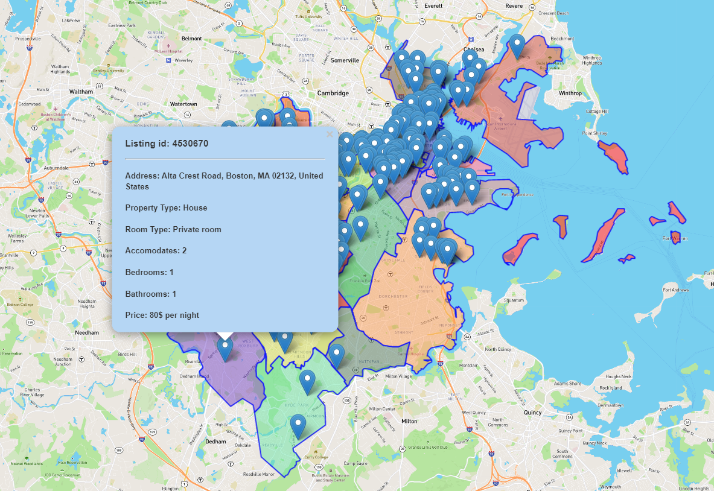

# Airbnb Price Prediction Using Machine Learning and Sentiment Analysis
## Group_6_Final_Project

---

## Team Members:

|  **Member**  |  **Role**  |  **Responsibilities**  |                                            
|  :---  |  :---  |  :---  |
| [Syed Ahmed](https://github.com/ahmed17777)  |  Machine Learning Lead  |  Manage the Machine Learning Model and Design  |
| [Pascal Duchesneau](https://github.com/Pascalduc)  |  GitHub Lead  |  Manage the GitHub Repository, Designed Interactive element, Heroku |
| [Raissa Fondjo]( https://github.com/RaissaFondjo)  |  Dashboard Lead  |  Manage the Presentation Google slides & Designed Mock-up Dashboard  |
| [Geetha Shanthibushan](https://github.com/gshanthibushan)  |  Project Coordinator  |  Manage the Technologies and tracking group ideas, decisions, progress, and Designed Tableau Dashboard Presentation  |
| [Lalchand Shivraj](https://github.com/LalchandShivraj)  |  Database Lead  | Manage the Database and ETL Process  |
 
Even though we have assigned role to each team member, the members will and to contribute equally throughout the final project.

---

## Overview: 
Estimating a price for short time stay lodging is a difficult task for the hosts when it comes to listing the property in Airbnb.  In addition, customers select rental based on price, review, and picture of the property, but the property may not live up to its listing.   Therefore, our team decided to develop a price prediction model using machine learning and one of natural language processing technique of, sentiment analysis.  

For this project we selected Airbnb datasets from Kaggle.  The datasets contain information about the city of Boston, MA Airbnb properties listings and customer’s reviews of these properties.  

## Source of Data: 

|  **Name**  |  **Data Source** |  **Data Details**  |      
|  :---  |  :---  |  :---  |
|  Kaggle  |  https://www.kaggle.com/airbnb/boston  |  Listings.csv, including full descriptions and average review score  |
|  Kaggle  |  https://www.kaggle.com/airbnb/boston  |  Reviews.csv, including unique id for each reviewer and detailed comments  |
|  Kaggle  |  https://www.kaggle.com/airbnb/boston  |  Calendar.csv, including listing id and the price and availability for that day  |


## Questions we want to answer with the data: 
- What are the key factors that affect the price of the rental property? 
    - We wanted to identify if the following key feature drive the price of the property: Neighborhood (Location), Competitor’s prices, Special Amenities, consumers’ reviews, and opinions.
    
- Within the same neighborhood what make a customer selecting one property vs another?
    - We wanted to identify if there is a correlation between reviews and # of times certain property being rent out.
    
- Which neighborhoods in Boston have the highest rental prices?
    - Reason behind the high price.


## Database ERD:
* PostgresSQL is used to store and manipulate data. The image below represents the tables of data that are uploaded onto the database in Postgres. The entity relational diagram allows for easier joining of tables with SQL and is a helpful reference while importing data into the database. There are two main tables with data that is used to build and perform the machine learning model. 
* The most common and obvious connect between the two datasets is the ID column.


* A sample code to merge the two tables can be found in the Jupyter Notebook file `AirBnB.ipynb`.

```
airbnb_df = pd.merge(listings_df, reviews_df, how='left', left_on=['id'], right_on=['listing_id'])
airbnb_df.head(10)
```

## Database - Getting the actual data:

* Two datasets were used: listings2017.csv and reviews2017 (in the Resources folder).
* They are linked by the id and listing.id of the respective sets.

Steps used in Transforming and Loading the data were:

* On examing the dataset, the team decided on which columns to keep. This was processed by opening the csv file in excel and removing the unwanted columns.
* As shown in the AirBnB_data_transform_and_clean_script.txt file, a database and tables were created in PostgreSQL. Due to the listings dataset containing special characters in columns that we needed as numeric, the columns were created as varchar.
* The datasets were then imported into the respective tables.
* The AirBnB_data_transform_and_clean_script.txt file also contained all the sql for breaking out the amenities column into individual amenities, removing unwanted characters, changing column type, dropping columns no longer needed and joining the listings and review tables to get reviews. Since there were multiple reviews for about we decided to take just one review per listing (using 'distinct on'). Further, listings that did not have a review were kept.
* The cleansed data was then exported in csv format (listings_with_reviews).
* We created a MongoDB account, create a cluster and added all team members, so they can access the data.
* Using MongoDB Compass to connect to the cluster, a database and collection were created and the data imported as airbnb_cleaned
* As team members used the data, they realized that three other columns from the original listings dataset would enhance the visualization, so we repeated the steps above and included the columns. This did not take very long to do as most of the processing was in the AirBnB_data_transform_and_clean_script.txt file.
* Using MongoDB Compass to connect to the cluster, a new database and new collection were created and the data imported as airbnb_cleansed.

All related ETL and Database scripts and files are in the [ETL_and_Database](https://github.com/Pascalduc/Group_6_Final_Project/tree/main/ETL_and_Database) folder.


## Machine Learning Model:

At this stage of the project, we did the following:
- Preprocessed the raw data 
- Performed an exploratory analysis 
- selected features for our machine learning algorithms to predict price 

In this section, I will explain my findings during this process. 

**Preprocessing**

With the raw data loaded into a DataFrame using PyMongo, the first step was to convert all numerical variables into int / float format for processing using `to_numeric()`. Next, we checked for nulls and decided to drop the null values since it accounted for a small percentage of our rows. Once this was done, we encoded all categorical variables into numerical values that can be read by a Machine Learning algorithm. 

**Exploratory Analysis**

In our exploratory analysis, we used the `describe()` method to create a statistical summary of our variables so we could assess our measures of central tendency and try to identify outliers. The next step was to use `corr()` to find variables that have a strong correlation with our target variable, price. We chose variables with a correlation coefficient above 0.20 to be used as features in our machine learning model. The following is a heatmap that shows correlation between our chosen variables: 

 


**Machine Learning**

With preprocessing complete, and features selected, we were ready to start testing our machine learning models. Our X variables included the features shown in the correlation matrix above, and our 'y' variable was price. We split the data into training and testing sets with a random state of 45, test size of 30% and training set size of 70%. We chose three different types of regression models to predict our target variable: Random Forest Regressor, Linear Regression, and Decision Tree regression. We wanted to see how these three different models will perform, and which one of them will give us the highest R squared value. 

The Random Forest Regressor algorithm is a supervised learning model that can be used for classification and, in our case, regression. We chose this algorithm as it is good at learning complex and non-linear relationships, and is easy to interpret. Limitations for this model include: chances of overfitting and may require more memory to run model. This model gave us the highest R squared value (0.56) out of all models tested, as shown below. Of course, we also utilized the simple Linear Regression supervised learning model, which is easy to implement, less complex when compared to other algorithms, and simple to interpret. Limitations for this model include: the model can be negatively affected by outliers and it could oversimplify real world problems by assuming linear relationships between variables. This model gave us an R squared value of 0.51. The final model we used was the decision tree model, which is a simpler version of the Random Forest model. We included this model as it is easy to understand and interpret, works with numerical and categorical features, and requires little data preprocessing. However, one drawback of this model is a tendency to overfit. The decision tree model gave us an R squared value of 0.47, which was the lowest of all models tested. 


As we can see, further optimization needs to be done to make our models more accurate. I plan on optimizing these models for the next segment by:
- Dimensionality reduction by means of feature elimination or feature reduction 
- Modifying the train, test split 

**Model Optimization**

Since the previous segment, we have worked on optimizing the machine learning model to boost R squared scores for each model. We did so by reselecting appropriate features from the dataset, changing the train test split to 67%, 33% respectively and removing outliers that were present in the target variable. We have also added a Deep Learning Model with two hidden layers. The final feature selection for our machine learning (based on correlation coefficients) models is as follows: 

- `room_type`
- `accomodates`
- `bathrooms`
- `bedrooms`
- `beds`
- `price`
- `security_deposit`
- `cleaning_fee`
- `air_conditioning`
- `cable_tv`
- `family_kid_friendly`
- `gym`
- `elevator`

As we can see from the image below, there were outliers present in the price distribution which were giving the data a right skew. As we can see from the statistical summary, most of the samples from the price column are within the range of $215 and few samples that are less than $20 and greater than $500. 


We ruled these ranges as outliers and removed them from the price distribution, which gave us a more normal looking distribution as seen below. 


**Deep Learning Model**

In addition to our model optimization efforts, we added a Deep Learning model. They are useful because their structure of layers can be adapted to many types of problems, and their hidden layers reduce the need for feature engineering. One weakeness of this model is that they are computationally intensive to train. 

**Final Results**

Here is a chart comparing the R squared value of all the optimized models


- Random Forest R Square Value : 0.6401468962074119
- Deep Learning R Square Value : 0.5832696557887808
- Decision Tree R Square Value : 0.5747005190100378
- Linear Regression R Square Value : 0.5567145646136205

All related Machine Learning scripts and files are in the [Machine_Learning](https://github.com/Pascalduc/Group_6_Final_Project/tree/main/Machine_Learning) folder.


## Dashboard:
To get the insight view of the Boston dataset, we used Tableau Visualization method to demonstrate the findings and for the further analysis. Furthermore, we created a website using GitHUb to present our project findings; as a navigation option we are displaying following tabs separately: Home, Dashboards, Machine Learning and GitHub Repository pages. In the Home tab we are in the process of creating Price Prediction calculator with the following features: Neighborhood, Bedroom, Quality, Room Type, Accommodate, etc. 

|  **Objective**  |  **Link** |  **Description**  |      
|  :---  |  :---  |  :---  |
|  Anlysis  |  [Tableau](https://public.tableau.com/app/profile/geetha.shanthibushan/viz/AirbnbPriceAnalysisPrediction/AirbnbPriceAnalysis_1)  |  The Visual Analysis  |
|  The Interactive Elements |  [Heroku](https://airbnb-top200-mapping.herokuapp.com/)  |  Boston neighborhoods and the top 200 listings  |
|  Website  |  [GitHub](https://raissafondjo.github.io/Group_6_Final_Project/templates/index.html)  |  The Website deployed on github (Work in progress)  |
|  Presentation  |  [Google Slides](https://docs.google.com/presentation/d/1aEzAcnQPQ26Mgu3uyPxv9UKH1f7kKL-D-o2jjF8_G2g/edit?usp=sharing)  |  Google Slides for the presentation (Work in progress) |

## Following Tools were used:
  * Tableau Desktop App - exported data out of MongoDB into JSON files (airbnb_cleansed)
  * Tableau Public Online version - exported data out of MongoDB into csv files (airbnb_cleansed)
  * Jupyter notebook for data cleaning and Mechine learning
  * Tableau for visualizations - Imported data into Tableau.
     - Created and style worksheets, dashboards, and stories in Tableau.
  * Visual Studio Code for our website code (js,html,css) 
 
## The Interactive Elements:
  * An interactive map was created showing Boston neighborhoods and the top 200 listings based on `review_scores_rating`. For this, we first connected the Mongo database through `PyMongo.MongoClient` module while hiding our login credentials from uploaded code using the `getpass` function. A DataFrame was then generated with the columns we wanted to list on the map, then sorted based on score ratings before saving the data in a geojson format. 

  * From the geojson file containing the longitude and latitude, a pin and popup were added to the map in JavaScript and HTML, which worked locally.



  * We are now working on the next step, which is to deploy the map online using Heroku and Flask app. We need to find a way to read in the hidden API key to be able to display the map.
  
## The Visual Analysis Method:

We used visual analysis method to understand the dataset and to answer our questions.  This technique was the faster way for us to understand the dataset and to design our machine learning model.

## Results:

### What are the key factors that affect the price of the rental property?

#### Room Type:  
In the dataset there are three type of room types: homes/apartments, private or shared rooms; The below figure indicates the average price for each room type, the color and the price shows details about the property type.  The chart indicating that Entire home rental price are higher than private room or shared room.  


#### Property Type:  
Property characteristics, which is property type also play major role when it comes to pricing the rental unit. Price for each property type boken down by room type. Colour shows details about the propery type and the highlighter option to provide select and show specific Neighborhood. Below figure indicates that regardless of the room type property such as Apartment and house rental price are significantly higher than other type of property.


#### Number of Reviews:
Customer reviews significantly affect the prices, and the figure below indicate the relationship of number of review and the type of room and property. Distinct count of Number Of Reviews for each Room Type broken down by Property Type.  Color shows details about Property Type and the highlighter option to provide select and show specific Neighborhood. Based on the chart we can identify that Apartment and house rental has the higher number of reviews.


#### Amenities:
The below chart represent the amenities provided by the host for the rental units, we can indicate that based on 95% of the rental unit have access to Wireless internet and these amenities are based on client needs.


### Which neighborhoods in Boston have the highest rental prices?

In the Airbnb Boston listing dataset neighborhoods are separated into 25 districts.

#### Listing Price by Neighborhood
Comparing the average price of the neighborhoods and the listing count for each neighborhood to determine the relationship between the neighborhood average price and listing count.  
The illustration below indicating that South Boston Waterfront, Bay Village, Leather District are the top three neighborhood that have higher average prices by listing.   


#### Popular Neighborhood by listing count
The most popular neighborhood based on listing are Jamaica Plain, South End and Back Bay. 

We can conclude that neighborhood with fewer listings have higher average listing price and neighborhood with higher listings has lower average price.

### Within the same neighborhood what make a customer selecting one property vs another?

#### Popular Neighborhood comparison with Number of listing, Average Price, Review Scores
We wanted to identify if there is a correlation between count of Listing, Avg. Review Scores Rating and Avg. Price for each Neighborhood.  Color shows details about count of Listing, Avg. Review Scores Rating and Avg. Price.


#### Treemap - Comparative analysis of the Price
Color shows average of Price.  Size shows average of Cleaning Fee.  The marks are labeled by Accomodates, Bathrooms, Beds, Room Type, Property Type, Neighborhood, average of Total Fee and average of Review Scores Rating. The view is filtered on average of Total Fee, which ranges from $25 to $1,500.


* Work file: [Dashboard - Tableau](https://github.com/Pascalduc/Group_6_Final_Project/tree/main/Dashboard%20-%20Tableau).
* Work file: [Dashboard - Website GitHub](https://github.com/Pascalduc/Group_6_Final_Project/tree/main/Dashboard%20-%20Website%20GitHub).
* Work file: [Dashboard Presentation - Google Slides](https://github.com/Pascalduc/Group_6_Final_Project/tree/main/Dashboard%20Presentation%20-%20Google%20Slides).


## Result of analysis
## Recommendation for future analysis

Although we spent quite some time optimizing our machine learning models to produce an R squared value closer to 1, there are some changes that should be considered for future analysis. One of those considerations would be to perhaps use a logarithmic scale on the target variable, to further reduce the skewness towards large values in the dataset. This would give us a more normalized distribution to work with, which may enhance our results. Some further considerations for future analysis include: 

- Supplement data with more current data from Airbnb
- Add unsupervised learning to cluster patterns within the dataset, which could uncover relationships within variables 
- Performing a qualitative assessment of how reviews affect Airbnb price 

## Anything the team would have done differently
